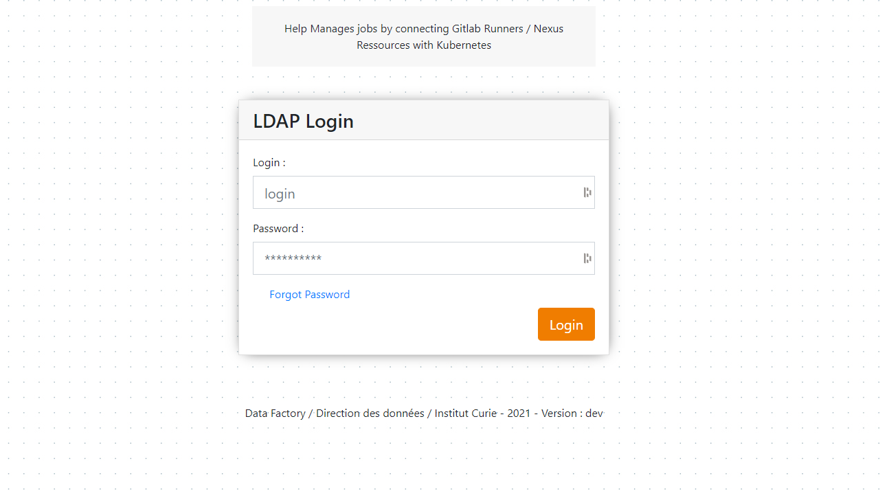
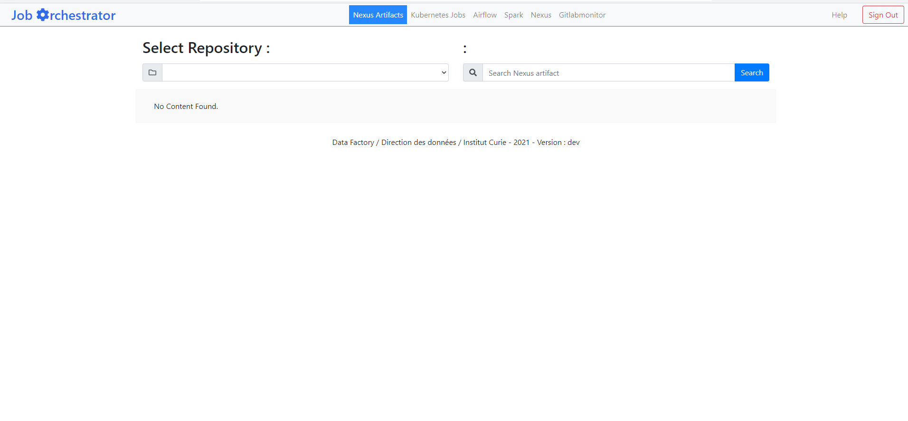
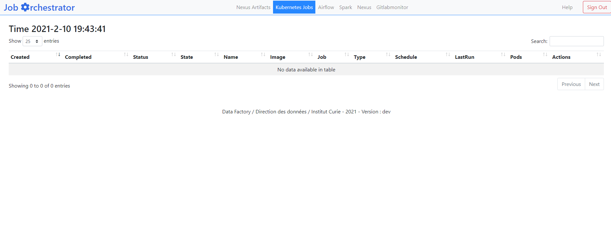

* [Goal](#goal)
* [Get Started](#get-started)
	* [Dependencies](#dependencies)
	* [Configuration](#configuration)
		* [Application Configuration File](#application-configuration-file)
		* [LDAP Configuration File](#ldap-configuration-file)
		* [NFS Configuration File](#nfs-configuration-file)
	* [Run it !](#run-it-)
		* [Docker Image](#docker-image)
		* [Helm Chart](#helm-chart)
		* [From Sources](#from-sources)
* [Screenshots & User Guide](#screenshots--user-guide)
* [Build the doc](#build-doc)
* [Runners](#Runners)

# Goal

Job Orchestrator main goal is to enables developer to use a DevOPS approach as easy as possible. In order to do that, we connect to different API : 

- **Gitlab API** : gives use the ability to search for certain **Docker  images** into Gitlab Docker registry with the name : `runner` in it. If an image contains that word, it is considered as an image that can run jobs from **Nexus**.
- **Nexus API** : Nexus stores jobs. We use Nexus API to search on repositories for jobs that we want to **run** with **Gitlab runner images** on **kubernetes**
- **Rancher API** : After choosing our **Nexus job** and our **Gitlab runner Docker image** we can configure our task. At the end of the form when submitting it, job orchestrator creates a **Kubernetes Job Resource** and deploys it with the **Rancher** API.

See more about [Runners](#Runners)

# Get Started

As you may have understood, Job orchestrator needs an **ecosystem** of application in order to work. It serves as a pass between all application's APIS.

## Dependencies

- Kubernetes Cluster `>=v1.15.15`

	- Rancher Installed `>=2.2.10` and API Endpoint accessible.
	- Need Rancher Project with rights to : [Check workload statues, API Access, Check logs].
	- Need a kubernetes Namespace with rights to : [deploy jobs, creates secrets, create configmaps].

- Gitlab `>=12.0.4`

	- Gitlab Installed and API Endpoint accessible.
	- Group Project containing Docker Runner Images repositories.
	- API ACCESS TOKEN for this particular group with rights to [ Read Registries, Read Repositories].

- Nexus `>=3.29.2-02`

	- Nexus Installed and API Endpoint accessible.
	- Default Repository
	- User / Password with rights to [Read artifacts, Search Queries]

- Spark [Optional]

	- Url to Spark UI

- Airflow [Optional]

	- Url to Airflow UI

## Configuration

### Application Configuration File

`/var/www/html/conf/conf.php` : 

```php
<?php 

// PROXY
define('PROXY_CONF',"proxy.domain.net");
define('NO_PROXY_CONF',".domain.net");

// LDAP
define('LDAP',FALSE);

// KUBERNETES / RANCHER
define('KUBERNETES_API_URL','https://<rancher-url>/v3/clusters/c-*****');
define('KUBERNETES_ACCESS_KEY','token-******');
define('KUBERNETES_PROJECT_KEY','p-******');
define('KUBERNETES_ACCESS_SECRET','*****************************');
define('KUBERNETES_NAMESPACE','<namespace>');

// NEXUS
define('NEXUS_URL','http://localhost:8081/');
define('NEXUS_API_URL','http://localhost:8081/service/rest/v1/');
define('NEXUS_DEFAULT_REPOSITORY','<default-repo>');
define('NEXUS_LOGIN',FALSE);
define('NEXUS_USER', '<user>');
define('NEXUS_PASSWORD', '*****************');

// GITLAB
define("GITLAB_API_URL","https://<gitlab-url>/api/v4/");
define("GITLAB_API_ACCESS_TOKEN","*****************");
define("GITLAB_GROUP_PROJET","<gitlab-group-project>");
define("GITLAB_MONITOR_URL","<gitlabmonitor-url>");

// SPARK
define('SPARK_LIVY_URL', 'http://<spark-url>/ui');

// AIRFLOW
define('AIRFLOW_URL','http://<airflow-url>/admin/');

?>
```

Job Orchestrator Uses **LDAP** to **authenticate users**. 

> *You can bypass the auth system by changing the LDAP var to False (default).*

 If you want to use LDAP, you have to set a ldap-conf file : 

### LDAP Configuration File

`/var/www/html/ldapconf/conf.php` :
```php
<?php 

// Ldap configuration Array
$config = [  
	'hosts'    => ['<ldap-ip>'],
	'base_dn'  => '',
	'username' => '*****************',
	'password' => '*****************',
	'account_suffix'   => ''
];

// Auth chain for filter autorised users to connect to the application.
$service_ldap_authorization_domain = 'CN=,OU=,DC=';

?>
```

### NFS Configuration File

For some tasks, you may need to create mounting points on runners. In order to register the rights access on the ENV variables into the pod, we have to give them to Job Orchestrator. The following configuration file serve this purpose : 

`/var/www/html/conf/conf_cifs.json` **[Optional]** :
```json
{
	"nfs-server-1": {
		"name": "<nfs-server-ip>",
		"user": "<nfs-user>",
		"password": "**************",
		"domain": "<nfs-domain>"
	},
	"nfs-server-2": {
		"name": "",
		"user": "",
		"password": "",
		"domain": ""
	},
	...
}
```

## Run it !

You can run job orchestrator from 3 different ways : 

### Docker Image 

To run anywhere : 

```bash
docker run -p 80:80 -v conf/:/var/www/html/conf/ ghcr.io/curie-data-factory/job-orchestrator:latest
```

### Helm Chart

To deploy in production environments :

```bash
helm repo add curiedfcharts https://curie-data-factory.github.io/helm-charts
helm repo update

helm upgrade --install --namespace default --values ./my-values.yaml my-release curiedfcharts/job-orchestrator
```

More info [Here](https://artifacthub.io/packages/helm/curie-df-helm-charts/job-orchestrator)

### From sources

For dev purposes : 

1. Clone git repository :
```bash
git clone https://github.com/curie-data-factory/job-orchestrator.git
cd job-orchestrator/
```
2. Create Conf files & folders :
```bash
mkdir conf ldapconf
touch conf/conf.php
touch conf/conf_cifs.json
touch ldapconf/conf.php
```
3. Set configuration variables [see templates above](#configuration)
4. Then run the [Docker Compose](https://docs.docker.com/compose/) stack.

```bash
docker-compose up -d
```

5. Exec into the docker image

```bash
docker exec -it joborchestrator /bin/bash
```

6. Resolve composer package dependencies. See [Here](https://getcomposer.org/doc/00-intro.md) for installing and using composer.

```bash
composer install --no-dev --optimize-autoloader
```

# Screenshots & User Guide





# Build Doc

The documentation is compiled from **markdown sources** using [Material for MkDocs](https://squidfunk.github.io/mkdocs-material/)
To compile the documentation : 

1. Go to your source directory : 

```bash
cd job-orchestrator
```

2. Run the docker build command : 

```bash
docker run --rm -i -v "$PWD:/docs" squidfunk/mkdocs-material:latest build
```

# Runners

Runners are a type of containers that contains langage specific binaries that enables task to be completed on a well-defined and managed software environment, assuring reproducibility and predictability.

At the curie institute we use runner docker images for every task running in our cluster.
The runner can be defined by any base docker image if it carries a **python** env and can execute the `bootstrap-script.py` at start.

The bootstrap script can be found in the `script` folder of this repo.

____
Data Factory - Institut Curie - 2021
