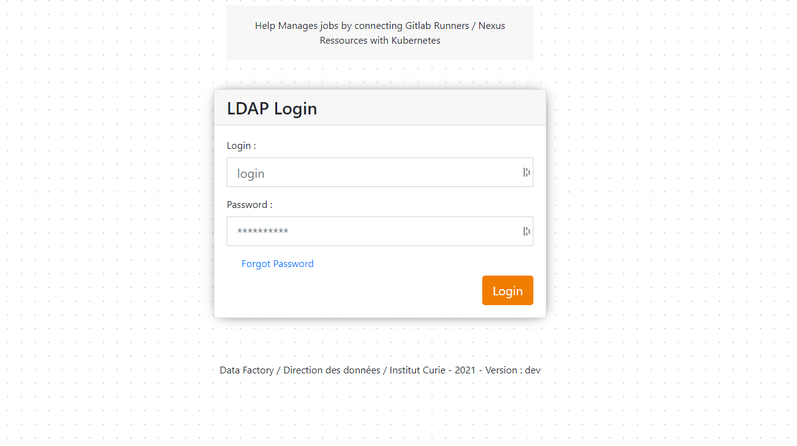
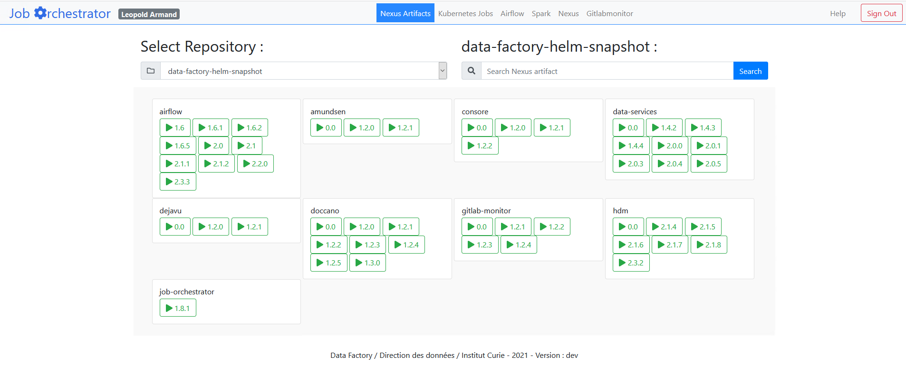
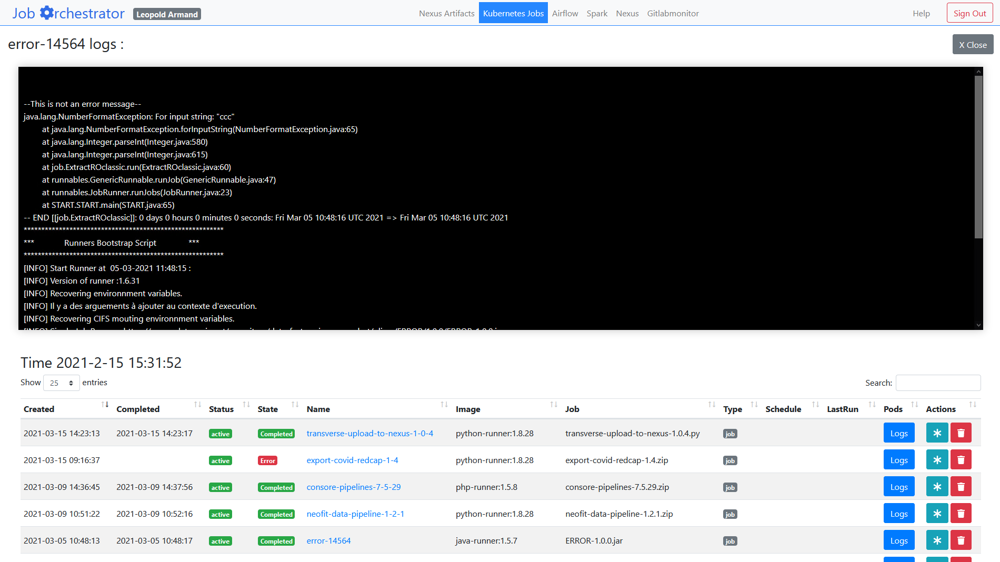

# Guide Utilisateur

## Qu'est ce que c'est ?

Job Orchestrator est un outil qui permet de centraliser toutes les activités de processing de la direction des data de l'Institut Curie. C'est une interface qui permet de communiquer avec les différents composants de la chaine de traitement des données de l'Institut Curie.

## Aperçu & Mannuel d'utilisation

### Page de Connexion

La page de connexion utilise la connexion LDAP, seul les personnes de l'équipe **data.office** peuvent se connecter sur ce service. 

____________________

### Page de listing des répertoires

La page de listing des répertoires Nexus permet de selectionner un répertoire **Nexus** sur lequel on a téléchargé nos ressources à executer.

* On peut rechercher dans le répertoire Nexus selectionné pour affiner sa recherche.
* On peut cliquer sur le bouton correspondant à la version du binaire à executer. Qui nous permettra de configurer le contexte d'execution de notre ressource sur le cluster.

_____________________

### Configuration du contexte d'execution

La page de configuration permet de définir les options de configuration pour l'execution de notre ressource.
Elle est découpé en plusieurs parties : 

!!! note "1. Ressource to Run"
	The resources to run is the package or compiled runnable file that you want to execute. Basically it's your job. It has a generated job name that you can edit. You can select the exact Nexus resource to run just bellow.
!!! note "2. Runner"
	The runner is the docker container in which your job will run. Be careful to choose a container that fits your executable requirements.
!!! note "3. Runner Configuration"
	The runner configuration is all the settings around the container. It lets you set up CRON scheduling, mounting points etc...
!!! note "4. Deploy"
	When executing the deployment,a Kubernetes resource will be created and all the configurations will be applied. It will then run the chosen container. In the container, it will mount the CIFS volume if configured and pull the Nexus resource. It will then execute the resource.

_____________________

### Cas Pratique

Dans le cas pratique d'un développement d'un job ETL Talend: 

1. nous allons développer notre job ETL sur notre ordinateur, 
2. puis, commit/push sur notre répository GitLab, 
3. grâce au build/test automatique il va build et envoyer le job finalement testé et packagé sur Nexus. 
4. Une fois accéssible sur le répertoire Nexus, nous pouvons selectionner le job et enfin configurer son lancement sur l'environnement de production.

Et voila !

_____________________

### Listing jobs

Afin de vérifier la bonne execution des jobs, nous pouvons aller dans l'interface de listing des jobs.

* Nous pouvons visualiser : 
	*	la date de déploiement
	*	l'état du déploiement **(Active/Inactive)**
	*	l'état de fonctionnement des containers **(Scheduled/Initiated/Running/Failed/Stopped)**
	*	Le nom du job.
	*	Vérifier l'image utilisé pour executer la ressource.
	*	La ressource spécifiquement utilisé pour l'execution.
	*	Le Type de job **(job/CronJob)**
	*	Pour un **CronJob** on peut voir la fréquence de lancement (Schedule)
	*	Pour un **CronJob** on peut voir la date de dernière execution du job.
* Nous pouvons voir les logs du job ou du lancement de job le plus récent pour les cronJob.
* Nous pouvons avoir une traduction de notre job en tâche Airflow.
* Nous pouvons supprimer le déploiement.

____________________

### Apache Airflow

Nous avons intégré la possibilité de pouvoir consulter les jobs Apache Airflow. 
Apache airflow est un outil qui permet d'orchestrer des pipelines data. Il nous permet de suivre l'évolution de nos pipelines de données, ainsi que d'en assurer la maintenance si besoin.

____________________

### Gitlabmonitor

Gitlabmonitor est un outil qui permet de visualiser les pipelines de CI/CD qui s'executent à partir de Gitlab

____________________

### Nexus

Finalement il y a également à disposition un lien pour aller sur Nexus pour voir les ressources directement dans les répertoires.

____________________

### Spark

Il y a également il liens vers l'interface Spark pour pouvoir visualiser les jobs qui tournent sur l'environnement Spark.

